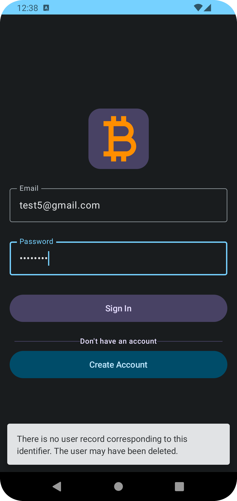

# Bitcoin Ticker App

Welcome to the Bitcoin Ticker App README! This Android app allows users to track cryptocurrency prices, view coin details, and manage their favorite coins.

## Table of Contents

- [About](#about)
- [Features](#features)
- [Screens](#screens)
- [Getting Started](#getting-started)
- [Firebase Authentication](#firebase-authentication)
- [Contributing](#contributing)
- [License](#license)

## About

The Bitcoin Ticker App is designed to provide users with real-time information about various cryptocurrencies, including their prices, historical data, and the ability to save favorite coins for easy tracking.

## Features

- View a list of available cryptocurrencies.
- Mark specific coins as favorites for quick access.
- Access detailed information about each coin.
- Customize the interval at which coin data is fetched and updated.
- Secure user authentication through Firebase.

## Screens

The app consists of the following screens:

- Authentication Screen: Allows users to sign up or log in using Firebase authentication.
- Coin List Screen: Displays a list of available cryptocurrencies.
- Coin Detail Screen: Provides detailed information about a specific cryptocurrency, including real-time price data and historical charts.
- Favorite Coin Screen: Shows a user's favorite coins for quick monitoring.

## Screenshots

Here are some screenshots of the CryptoCurrency App:

<table>
  <tr>
    <td></td>
    <td></td>
    <td></td>
    <td></td>
  </tr>
</table>

## Getting Started

To get started with the CryptoCurrency App, follow these steps:

1. Clone the repository: `git clone https://github.com/your-username/crypto-app.git`
2. Open the project in Android Studio.
3. Build and run the app on an emulator or physical device.

## Firebase Authentication

The CryptoCurrency App uses Firebase for user authentication. To enable Firebase authentication:

1. Create a Firebase project at [https://console.firebase.google.com/](https://console.firebase.google.com/).
2. Configure Firebase in your app by adding the Firebase configuration details.
3. Enable the authentication method (email/password, Google, etc.) you want to use.
4. Update the app code to integrate Firebase authentication.

## Contributing

We welcome contributions to the CryptoCurrency App! To contribute:

1. Fork the repository.
2. Create a new branch for your feature or bug fix: `git checkout -b feature/your-feature-name`
3. Make your changes and commit them: `git commit -m "Add feature"`
4. Push to the branch: `git push origin feature/your-feature-name`
5. Create a pull request.

## License

This project is licensed under the [MIT License](LICENSE). You can find more details in the [LICENSE](LICENSE) file.

---

Feel free to customize the sections and information as needed to match your app. Replace placeholder texts with actual content. Good luck with your CryptoCurrency App development in Kotlin!
